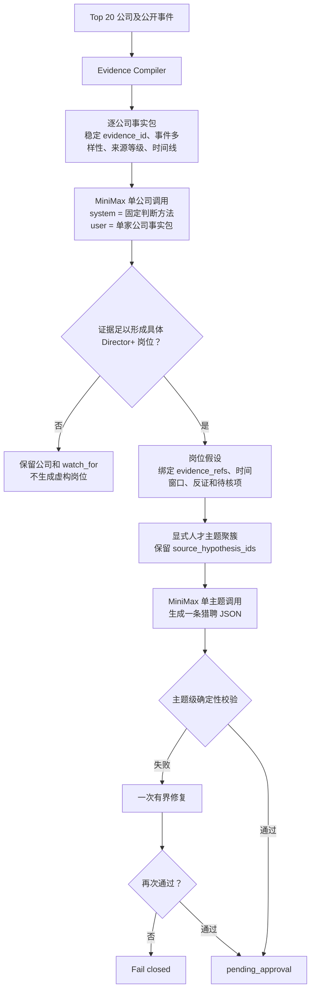

# Evidence-bound MiniMax 岗位推断与 JD 工作流

## 生产路径

## Evidence packet

每家公司单独构建事实包。系统不再截取数组前六条，而是：

- 按 event ID 或稳定哈希去重；
- 先覆盖不同事件类型，再补充剩余高价值证据；
- 优先招聘广告之前的上游事件和 A/B 级来源；
- 保留 `evidence_id`、日期、事件类型、阶段、来源等级、事实摘要、人物和机构；
- 把 `job_ad` 标为晚期验证，不能成为早期岗位推断的唯一依据。

MiniMax 返回的每个岗位必须引用事实包中真实存在的 `evidence_id`，程序会验证
引用集合，未知 ID 直接拒绝。

## 单公司岗位推断

每家公司独立调用。输出先描述 `stage_transition` 和
`organizational_gaps`，再决定是否形成 0–3 个岗位。

岗位包含：

- `specific_title`、`capability_gap`、`mandate`、`why_now`；
- `near_term`（0–90 天）或 `watchlist`（91–180 天）；
- `evidence_refs`、`evidence_against`、`unknowns_to_verify`；
- 精简的 `key_outcomes`、`must_have_signals`、`preferred_signals` 和 `specificity_terms`；
- 单城市及其公开依据；城市没有公开证据时保留在公司分析中，但不进入可发布主题。

证据门槛经过校准并由代码确定性执行：两个不同事件类型、共同指向同一新增责任
的上游事件，或一个直接创造新责任的 A 级运营变化，可以支持 near-term 岗位；
单独融资、合作意向或招聘广告不能通过。系统不会等招聘广告出现才行动，也不建立
岗位结果评分。证据不足时允许空
`role_hypotheses`，并输出 `watch_for`。若模型返回泛化标题或结构错误，只允许一次
带确定性错误原因的公司级修复；仍不合格则该公司不生成广告。

## 人才主题

聚簇直接使用具体岗位和能力词，不再先压缩到宽泛固定模板。排序依次考虑时间
窗口、覆盖公司数、独立证据数和原 Lead 顺序分；后者只负责排序，不评价结果
质量。主题保留：

- 来源岗位 ID 和公司索引；
- 共同 mandate、时间窗口、能力词；
- 结果、候选人信号、城市及城市依据；
- 对应的公开证据引用。

只有标题相同，或职能相同且 specificity terms 高度重合的岗位才会合并。

## 单主题 JD

每个主题独立调用一次 MiniMax。输入只含当前主题和一个完整 JSON 示例。校验时：

- 标题必须与主题标题完全一致；
- 城市必须与主题的单城市一致；
- 至少自然包含当前主题自己的两个 specificity terms；
- 猎聘字段集合、类型和枚举保持一致；
- 公开内容匿名；
- 同批标题和 payload 不重复。

首次失败允许一次修复；再次失败则整个主题 fail closed。

## MiniMax API

Lead Radar 继续读取 OpenClaw 的主模型、Provider、base URL 和 API Key，但直接
调用 Provider API。请求把固定判断方法放在 system message，把动态事实包放在
user message，并设置 `reasoning_split=true`。单次调用超时 240 秒；429、5xx 和
网络错误最多有限重试两次；整批默认 3600 秒 deadline；每日 launcher 使用文件锁
防止 cron 与人工重跑重叠。部分公司分析失败会写入 bundle、让生成脚本非零退出，
并在飞书中显示分析覆盖率和错误摘要。
