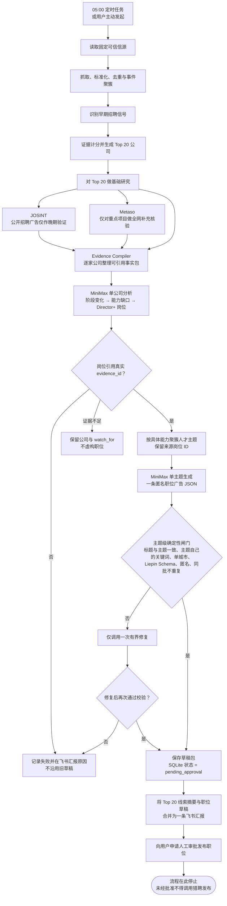

# Lead Radar 到人工审批申请的流程

## 边界

- 每日任务只做 Top 20 基础研究；深度研究和 float 分析由用户主动触发。
- MiniMax 按公司独立推测组织缺口，再按人才主题独立生成职位广告；模型和凭证从 OpenClaw 配置读取。
- 证据不足的公司仍保留在 Top 20，但只输出 watch_for，不为了职位数量制造岗位。
- 确定性校验阻止宽泛职位、多城市、企业身份泄露或不符合猎聘字段契约的草稿进入审批。
- 本流程只到“申请人工审批”为止；猎聘发布属于审批后的独立执行阶段。
