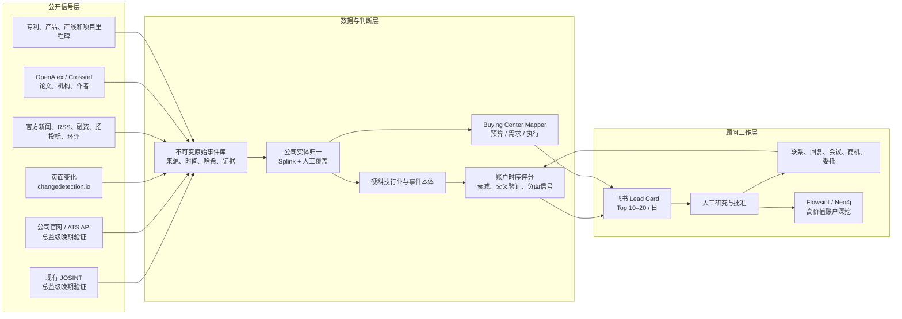

# HT Lead Radar：硬科技自动获客系统方案

版本：0.2  
日期：2026-07-24  
适用范围：Michael Page 中国区半导体、具身智能、商业航天、核聚变等硬科技业务

## 1. 结论先行

真正需要建设的不是 Lead Scraper，而是一个 **Account Intelligence and Next-Best-Action System**：

> 从公开信号发现组织变化，将零散职位和事件归一到公司账户，判断招聘需求出现的概率与紧迫度，绘制三人 Buying Center，并把带证据、可解释、可复核的 BD 建议推给顾问。

本方案有两个不可妥协的业务约束：

1. **只寻找总监级以上机会**：Director、Head、VP、GM、CxO，以及经证据确认拥有同等组织领导责任的岗位。经理、高级经理、专家、高级专家和其他个人贡献者不进入 Lead 队列。
2. **必须尽量领先于招聘广告**：融资、订单、产能、基地、牌照、重大技术里程碑、组织变化等上游信号是主触发器；职位广告是晚期验证信号。只有招聘广告、没有上游证据的账户不能进入 `BD Now`。

最优路径是复用现有资产：

- **JOSINT**：继续承担猎头公司职位采集、定时运行、失败重试、飞书同步。
- **changedetection.io + 官方 ATS API**：监测总监级以上公司直招岗位和页面变化，但作为验证层使用。
- **RSSHub、OpenAlex、Crossref、官方新闻/公告源**：补齐非职位信号。
- **Splink**：做公司名称、域名、品牌和子公司的概率实体归一。
- **Academic Mapping**：做论文、专利、作者、机构和公开职业联系路径。
- **Flowsint/Neo4j**：做高价值账户的深度图谱调查。
- **飞书多维表格**：继续作为顾问日常操作台，不在 MVP 再部署一个 CRM。

首期不建议引入 Airbyte、Huginn、n8n、Twenty、Superset 或另一个 OSINT 平台。它们各有价值，但现阶段会重复现有调度、数据表或图谱能力。

## 2. 业务问题应如何定义

原始问题是“连续去 BD 谁”。系统要把它拆成四个可测量的问题：

1. **Account discovery**：哪些目标公司发生了与扩张、技术突破或人才缺口有关的事件？
2. **Role hypothesis**：这些变化可能创造哪一个总监级以上的组织岗位？
3. **Timing**：能否在首个相关公开招聘广告之前介入？
4. **Buying center**：谁拥有预算、谁拥有需求、谁执行招聘？
5. **Action learning**：什么信号和联系人组合最终带来了回复、会议、商机和职位委托？

单个职位不是 Lead；单个姓名也不是答案。一个可执行 Lead 至少包含：

- 一个已归一的公司账户；
- 一个总监级以上的招聘/组织扩张假设；
- 至少一条发生在招聘广告之前的上游信号；
- 两类以上相互独立的证据，或一条极强的一手证据；
- 三类 Buying Center 角色中的至少两类；
- 分数、置信度、风险和建议动作；
- 可追溯的来源链接和时间。

## 3. 为什么这个方法成立

### 3.1 职位是需求验证信号，不是本系统的首选触发信号

Bagger 等人基于丹麦企业数据发现，发布职位与企业招聘率提高 4.5 个百分点相关，新增招聘约三分之二发生在职位发布后两个月内；收入和增加值增长也会预测职位发布。这证明职位能验证需求，但对猎头 BD 而言，它往往意味着企业已经启动公开招聘，因此应当被视为晚期信号。[IZA Discussion Paper 14436](https://docs.iza.org/dp14436.pdf)

在线职位数据同时存在覆盖偏差、重复发布、常年职位和“发布但未招聘”等问题，因此不能把职位数量直接等同于招聘需求。[Kureková 等人的方法论研究](https://www.iza.org/publications/dp/8555/using-internet-data-to-analysethe-labour-market-a-methodological-enquiry)

经理、专家等非目标层级职位不会生成 Lead。它们最多作为已经存在上游信号时的弱背景证据，而且不能把一个账户单独推入 `BD Now`。

### 3.2 融资、专利、研发和产能事件能补充招聘信号

研究显示，初创公司的首项专利获批与后续就业和销售增长相关，专利审批延迟会推迟增长，因此专利不只是技术标签，也可作为中长周期组织扩张信号。[NBER：The Bright Side of Patents](https://www.nber.org/papers/w21959)

风险投资与初创公司员工增长之间也有实证关联，但其中同时存在投资筛选效应，融资应作为加权信号而不是确定性结论。[Davila、Foster、Gupta](https://profiles.wustl.edu/en/publications/venture-capital-financing-and-the-growth-of-startup-firms)

### 3.3 组织采购和猎头委托都不是单一决策人

经典组织购买研究指出，企业购买通常涉及多名参与者，预算、使用需求、技术判断和流程执行并不集中在一个人身上。因此系统应该输出 Buying Center，而不是声称找到了唯一“决策人”。[Webster & Wind](https://faculty.wharton.upenn.edu/wp-content/uploads/2012/04/7215_A_General_Model_for_Understanding.pdf)

### 3.4 评分应最终由销售漏斗结果校准

销售线索排序研究建议建模完整漏斗，而不只是单步回复概率，并处理历史销售选择造成的样本偏差。[Duncan & Elkan, KDD 2015](https://dblp.uni-trier.de/rec/conf/kdd/DuncanE15.html)

因此 MVP 先使用可解释规则；只有积累足够的联系、回复、会议、商机和委托结果后，才训练逻辑回归或梯度提升模型。

## 4. 现有 JOSINT 审计

2026-07-23 对服务器 `/home/admin/.openclaw/workspace/skills/web-ad-radar/` 的只读盘点结论如下。

### 已经做得好的部分

- 8 个中国市场猎头公司公开职位源已经启用。
- 已有 SQLite 去重、首次/最后发现时间、职位正文、行业和职能标签。
- 已有定时执行、看门狗重试、飞书同步和通知。
- 截至 2026-07-22，本地库有 584 个唯一职位。
- 2026-07-23 运行扫描 188 条，新增 21、更新 167、失败 0。

这些能力应当保留，不应重写。

### 从“职位雷达”到“获客系统”的关键缺口

| 缺口 | 业务后果 | 建议 |
|---|---|---|
| 以职位为中心，没有 canonical company | 同一公司、品牌、子公司和匿名客户无法合并 | 建立公司、别名、域名和集团关系表 |
| 只有 URL 去重 | 同一岗位跨猎头、跨站重发会被重复计数 | 加入 JD 指纹、语义相似和公司归一 |
| 主要是猎头公司职位 | 发现需求时往往已经有竞争对手介入 | 优先增加公司官网、ATS 和非职位领先信号 |
| 报告在雇主推断之前生成 | 日报与最终分析状态不一致 | 先持久化全部分析，再生成唯一日报 |
| 雇主推断写飞书，本地库不完整 | 出现“本地事实源/飞书事实源”分裂 | 所有模型输出先写 canonical store，飞书只做镜像 |
| 每天只分析很小的新职位子集 | 无法形成稳定的账户级 BD 队列 | 对账户做增量聚合，而不是只对新职位做摘要 |
| 行业规则存在明显误判 | 如“知名基金参投”被“基金”触发成 VC/PE | 建立硬科技本体、否定规则、上下文判断和抽检 |
| 没有联系人和销售结果 | 系统无法回答找谁，也无法学习 | 增加 Buying Center、触达和漏斗结果表 |

## 5. 总体架构



### 设计原则

- **API 优先，页面监控其次，浏览器爬取最后。**
- **规则做确定性提取，LLM 处理歧义和解释。**
- **原始证据不可变，解析和评分可以重跑。**
- **公司账户是操作单位，职位只是账户事件。**
- **上游事件负责发现，招聘广告只负责验证。**
- **总监级以上是硬门槛，不以薪资或稀缺性替代职级。**
- **机会分和联系人可达分分开计算。**
- **任何外联都经过顾问批准。**

## 6. 来源策略：该复用什么

| 场景 | 首选工具/来源 | 角色 | MVP |
|---|---|---|---|
| 猎头职位 | 现有 JOSINT | 总监级以上需求的晚期验证 | 保留 |
| Greenhouse 职位 | [官方 Job Board API](https://developer.greenhouse.io/job-board.html) | 总监级以上公司直招验证 | 是 |
| Lever 职位 | [官方 Postings API](https://github.com/lever/postings-api) | 总监级以上公司直招验证 | 是 |
| 其他官网变化 | [changedetection.io](https://github.com/dgtlmoon/changedetection.io) | 页面 Diff、Webhook、Playwright | 是 |
| 中国公开内容 Feed | [RSSHub](https://github.com/DIYgod/RSSHub) | 统一 RSS 入口 | 是，按源启用 |
| 论文/机构/作者 | [OpenAlex](https://developers.openalex.org/) | 开放学术图谱 | 是 |
| DOI/资助/作者元数据 | [Crossref REST API](https://www.crossref.org/documentation/retrieve-metadata/rest-api/) | 学术元数据补全 | 是 |
| 公司实体归一 | [Splink](https://github.com/moj-analytical-services/splink) | 概率记录链接 | 是 |
| 复杂网页解析 | [Crawl4AI](https://github.com/unclecode/crawl4ai) | 仅作为解析兜底 | 按需 |
| 账户关系深挖 | [Flowsint](https://github.com/reconurge/flowsint) | 图谱调查工作台 | 按需 |
| 跨站通用职位抓取 | [JobSpy](https://github.com/speedyapply/JobSpy) | 探索/备援 | 非核心 |
| 新 CRM/工作流平台 | Twenty、NocoDB、n8n | 与飞书/现有调度重复 | 暂不做 |

来源必须登记访问方式、许可、robots/服务条款、频率、字段、保留期、失败策略和业务负责人。遇到验证码、登录墙或明确禁止自动访问时，不绕过。

## 7. 信号本体

### 7.1 总监级以上硬门槛

系统先判断机会层级，再计算账户分数。未通过层级门槛的记录可以保存在原始库中，但不进入 Lead 队列。

自动进入目标层级的典型名称：

- CxO、总裁、副总裁、VP、SVP；
- 总经理、事业部总经理、BU GM、基地/工厂总经理；
- Director、总监、Head of、部门负责人；
- 项目总师、型号总师、首席科学家、Chief Engineer 等名称，前提是公开证据显示其拥有团队、预算或跨职能组织责任。

明确排除：经理、高级经理、主管、专家、高级专家、资深专家、Staff、Principal、Fellow、普通 Scientist/Engineer 和其他个人贡献者。高薪、人才稀缺或技术资历深都不能单独突破这个门槛。

“负责人”“首席”“总师”等模糊名称需要至少两项组织责任证据：

- 管理团队或负责组织搭建；
- 拥有预算、P&L 或重大项目资源；
- 直接向 CxO/总经理汇报；
- 对招聘和绩效有决策权；
- 对跨部门交付或外部业务结果负责。

### 7.2 信号时间线

| 阶段 | 距公开招聘的大致时间 | 信号 | 系统动作 |
|---|---:|---|---|
| Strategy / Capital | T-180～90 天 | 融资、增资、政府审批、土地/基地、重大订单、牌照、投资计划 | 生成总监级岗位假设，进入早期研究 |
| Build / Organize | T-90～30 天 | 新事业部/子公司、关键高管到任、设备采购、供应链定点、合作实验室、量产/试验节点 | 评分并建立 Buying Center，可进入 `BD Now` |
| Recruit | T-30～0 天 | 公司或猎头公开总监级职位 | 验证需求，但施加“已公开招聘”时机扣分 |
| Marketed / Competitive | T+0 天 | 多平台转载、多家猎头同时出现 | 降级或仅在存在暖关系时介入 |

进入 `BD Now` 必须满足：

1. 有明确的总监级以上岗位假设；
2. 至少一条 Strategy/Capital 或 Build/Organize 上游信号；
3. 上游信号早于首个相关公开职位，或当前尚未发现公开职位；
4. 通过公司冲突、禁止联系和证据置信度检查。

只有公开职位的账户最高只能进入 `Research / Watch`，不得由广告单独触发 `BD Now`。

### 7.3 跨行业通用信号

| 信号 | 阶段 | 典型含义 | 建议半衰期 |
|---|---|---|---:|
| 政府审批、土地、环评、基地或重大投资 | Strategy / Capital | 中长期组织和产能建设 | 120 天 |
| 重大客户订单、定点、项目中标 | Strategy / Capital | 新增交付责任和领导岗位 | 60 天 |
| 融资、增资、IPO 进展 | Strategy / Capital | 预算和扩张能力 | 45 天 |
| 新任 CEO/CTO/CHRO/事业部负责人 | Build / Organize | 组织重构和下一级领导团队搭建 | 30 天 |
| 新事业部、子公司、研究院或基地 | Build / Organize | 新组织需要总监级负责人 | 90 天 |
| 设备采购、合作实验室、供应链定点 | Build / Organize | 项目进入执行阶段 | 60–120 天 |
| 重大产品、量产、试验或许可里程碑 | Build / Organize | 从研发转向交付或规模化 | 60 天 |
| 专利簇、论文簇 | Build / Organize | 技术方向和潜在领导人才画像 | 180 天 |
| 公司官网发布总监级以上职位 | Recruit | 明确但较晚的招聘动作 | 14 天 |
| 猎头公司发布总监级以上匿名岗位 | Marketed / Competitive | 需求已被市场化且存在竞争 | 14 天 |
| 经理/专家等非目标职位簇 | Recruit | 只可做弱背景验证，不生成 Lead | 14 天 |
| 裁员、冻结、项目取消、现金风险 | Negative | 负面或延后 | 30–90 天 |

### 7.4 行业特定信号

#### 半导体

- 新厂/新线、洁净室、环评、设备 move-in、产能爬坡；
- tape-out、先进制程节点、良率改善、EDA/IP 合作；
- 设备和材料大单、国产替代认证、客户导入；
- 工艺整合、器件、良率、设备、厂务、封测等基层岗位簇仅用于验证，不作为目标岗位。

总监级岗位假设：Fab/基地总经理、制造总监、工艺整合总监、设备总监、良率总监、研发总监、供应链总监。

优先 Buying Center：Fab/BU GM、VP R&D/工艺整合负责人、HRD/TA/HRBP。

#### 具身智能

- 新融资、样机发布、量产、订单、机器人进厂；
- 执行器、灵巧手、传感器、控制器、供应链合作；
- 控制、SLAM、感知、操作、机械、电机和量产工程职位成簇时，仅用于验证组织扩张。

总监级岗位假设：机器人研发总监、控制/感知总监、产品总监、量产总监、供应链总监、海外业务总监。

优先 Buying Center：Founder/CEO、VP Engineering/Head of Robotics、HRD/TA。

#### 商业航天

- 发射/试车成功、许可证、卫星或运载订单、基地和工厂；
- 新一轮融资、重大试验节点、型号定型；
- 推进、GNC、航电、热控、结构和项目管理职位成簇时，仅用于验证项目团队扩张。

总监级岗位假设：型号总师、推进/GNC/航电总监、制造基地总经理、项目总监、供应链总监。

优先 Buying Center：CEO/CTO、推进/GNC/航电/型号负责人、HRD。

#### 核聚变

- 政府/产业资本投入、装置开工、first plasma 里程碑；
- 超导磁体、真空、低温、脉冲电源、材料和诊断系统招标；
- 高校实验室 spin-out、首席科学家或工程负责人加入。

总监级岗位假设：项目总师、首席科学家、磁体/真空/低温系统总监、工程总监、产业化总监。

优先 Buying Center：CEO/项目总师/首席科学家、工程或子系统负责人、HRD。

## 8. 公司实体归一

实体归一决定系统会不会把噪音错误地加总到同一个公司。

### 8.1 主实体

每个 `company` 至少保存：

- 中文法定名称、英文名、品牌名；
- 官网域名；
- 统一社会信用代码（公开且确有必要时）；
- 集团、子公司、合资公司、研究院关系；
- 行业、技术主题、城市和公司阶段；
- 手工确认状态。

### 8.2 匹配顺序

1. 官网域名或统一社会信用代码精确匹配；
2. 已确认别名字典匹配；
3. 规范化名称 + 地址/城市 + 领域特征匹配；
4. Splink 概率匹配；
5. 低置信度进入人工队列。

任何匿名雇主推断都必须保存候选列表、证据和置信度，不直接覆盖成事实。

## 9. 双评分模型

### 9.1 Account Opportunity Score

评分前先执行两个 Hard Gate：`target_seniority = director_plus`，并且 `has_upstream_signal = true`。任一不满足时，账户不得进入 `BD Now`，即使总分看似很高。

总分 0–100，另设最高 40 分风险扣减：

| 分项 | 上限 | 回答的问题 |
|---|---:|---|
| Upstream Demand Evidence | 40 | 是否有招聘广告之前的资本、订单、产能或组织信号？ |
| Director+ Role Fit | 25 | 是否能形成明确的总监级以上岗位假设？ |
| Timing / Lead Time | 15 | 是否仍处于公开招聘之前的可介入窗口？ |
| Commercial Value | 10 | 潜在职位数量、职级和费率价值如何？ |
| Evidence Confidence | 10 | 来源是否独立、一手、可复核？ |
| Risk Penalty | -40 | 是否已经公开招聘、多家猎头介入，或存在冻结、错误归一及合规风险？ |

时间衰减：

```text
effective_weight = base_weight × 2 ^ (-age_days / half_life_days)
```

交叉信号奖励：

- 30 天内有两类独立来源：+12；
- Strategy/Capital 信号后 90 天内出现 Build/Organize 信号：+12；
- 上游信号明确对应一个空缺的总监级组织责任：+10；
- 同一事件仅被多家媒体转载：只算一个来源类型；
- 经理/专家职位簇最多提供弱验证，不能贡献总监级岗位适配分；
- 公司公开总监职位后施加时机扣分，多家猎头已介入时进一步扣分；
- 猎头匿名职位只有雇主猜测：降低置信度，不算公司一手信号。

建议分层：

- `75–100`、置信度 A/B、通过两个 Hard Gate：**BD Now**
- `55–74`：**Research / Watch**
- `<55`：**Archive / Monitor**

只有公开职位信号的账户强制封顶 54 分；经理或专家岗位不生成 Lead Snapshot。

### 9.2 Contact Priority Score

不要用 Account Score 代替联系人排序。联系人分数单独计算：

| 分项 | 权重 |
|---|---:|
| 与招聘假设的角色相关性 | 40 |
| 预算或技术决策影响力 | 20 |
| 公开职业联系路径及验证质量 | 15 |
| 共同关系或暖介绍路径 | 15 |
| 任职信息时效性 | 10 |

Academic Mapping 的公开职业联系证据可沿用 A/B/D 分级：

- A：官方机构/公司页面可验证的职业联系方式；
- B：多个公开职业来源一致；
- D：只有公开身份线索，需人工继续核验；
- X：个人手机号、私人邮箱、数据经纪、泄露数据、账号枚举或猜测；不得进入触达队列。

## 10. Buying Center Mapper

每个高分账户默认找三类人：

1. **预算 Sponsor**：CEO、事业部总经理、CHRO，具体取决于公司规模和职位级别；
2. **需求 Owner**：CTO、VP R&D、Fab/基地负责人、项目总师或关键技术负责人；
3. **执行 Owner**：HRD、Talent Acquisition、对应业务 HRBP。

可额外记录一名 Warm Connector，例如前同事、投资方、董事、产业合作方或校友。

系统输出的是“推荐角色 + 公开证据”，不是保证某人拥有最终决定权。联系人当前任职、来源日期和公开联系路径必须可核验。

## 11. Lead Card

飞书中每个账户每天最多一张活跃卡片：

```text
账户：星瀚机器人（示例）
行业：具身智能
Opportunity Score：84 / A
状态：BD Now
时机：Pre-Ad；预计领先公开招聘 30–90 天
目标岗位：量产总监 / 制造运营总监

为什么是现在：
1. 20 天内完成 B 轮融资，明确资金用于量产和交付
2. 地方政府公示新生产基地项目，计划年内设备入场
3. 公司宣布首个批量订单和供应链合作，但尚未发布相关总监职位

招聘假设：
正在从样机团队转向量产交付，现有创始研发团队可能缺少一名同时负责
工厂爬坡、制造质量、交付和团队搭建的量产总监。

Buying Center：
- Sponsor：CEO / 联合创始人
- Need Owner：VP Engineering / 量产负责人
- Execution：HRD / TA Lead

风险：
融资新闻与多家转载已折叠；基地时间表仍需从官方项目文件复核。

建议动作：
先以“量产爬坡人才地图”切入，顾问人工确认联系人后联系。

证据：
[融资披露] [政府项目公示] [公司订单公告] [职位广告检查：未发现]
```

## 12. 数据模型和事实源

`sql/schema.sql` 给出了建议 PostgreSQL 表。核心关系是：

```text
raw_document → signal → company → lead_snapshot
                         ├─ person → buying_center_role
                         └─ bd_outcome
```

关键约束：

- 原始文档、解析信号和模型判断分层保存；
- 所有信号必须有来源、抓取时间、事件时间、内容哈希和证据片段；
- 飞书只镜像 canonical store，不成为唯一事实源；
- 模型版本、提示词版本和人工覆核结论可追踪；
- 个人信息字段按最小必要保存、限制访问、设置保留期和删除/反对处理流程。

## 13. 每日运营流程

```text
06:00  增量采集与页面变化检测
06:20  解析、公司归一、重复折叠、信号衰减与账户评分
06:40  Buying Center 增量更新
07:00  飞书推送 Top 10–20 和异常报告
上午   顾问人工审核：接受 / 暂缓 / 驳回 / 补研究
当日   记录联系、回复、会议、商机、委托及失败原因
每周   抽检误报、调权重、补别名和来源
每月   复盘信号到结果的转化及行业差异
```

顾问驳回 Lead 时必须选择原因，例如：

- 公司不在 ICP；
- 信号过期或重复；
- 招聘需求推断错误；
- 联系人不对；
- 已由其他顾问覆盖；
- 客户冲突/禁止联系；
- 无预算或冻结；
- 其他。

这些原因是后续模型最有价值的训练数据。

## 14. 实施路线图

### Phase 0：定义与基线，1 周

- 首期锁定半导体和具身智能；
- 建立 300–500 家种子账户、公司别名和优先级；
- 导入 JOSINT 现有 584 条职位；
- 建立总监级以上岗位字典、组织责任判定和明确排除词；
- 抽检 100 条行业、职级、职能和雇主推断，建立误差基线；
- 完成来源登记、数据字段、保留期和外联边界确认。

### Phase 1：账户事实源，2 周

- 建 PostgreSQL canonical store；
- 让 JOSINT 的抓取、雇主推断、标签和评分全部先落本地库；
- 增加 JD 指纹和 Splink 公司归一；
- 接入 Greenhouse、Lever，但只把总监级以上职位送入机会验证层；
- 用 changedetection.io 监控前 100 家目标公司的公告、项目和招聘页。

### Phase 2：多信号与 Lead Card，2 周

- 接入融资、工厂/环评、产品/订单、关键高管和 R&D 信号；
- 实施 `config/signal-weights.example.yaml`；
- 对账户做总监级 Hard Gate、时间衰减、信号折叠、交叉验证和广告后时机扣分；
- 每日推送飞书 Top Lead Card。

### Phase 3：Buying Center 和反馈，2 周

- 接入 Academic Mapping 的机构、作者、专利和公开职业证据；
- 生成 Sponsor / Need Owner / Execution Owner 三角色候选；
- 建立人工批准、禁止联系和退出机制；
- 记录完整 BD 漏斗。

### Phase 4：校准和扩行业，4 周以上

- 通过历史事件回测“系统是否提前发现需求”；
- 对照人工 BAU 做小规模 A/B；
- 扩展商业航天和核聚变信号本体；
- 累积至少 100–200 个有结果的 BD 样本后，评估逻辑回归或梯度提升；
- 只有在模型明显优于规则且可解释时，才替换部分手工权重。

## 15. 验收指标

### 数据质量

- 公司实体归一抽检准确率 ≥95%；
- 输出 Lead 的总监级以上岗位合规率 100%；
- 重复 Lead 率 <10%；
- Top 20 中至少 80% 有两类独立证据；
- Top Lead 至少 70% 有两名以上 Buying Center 联系人；
- 关键字段来源可追溯率 100%；
- 信号出现到飞书 Lead Card 的中位时间 <24 小时。
- 仅有招聘广告、没有上游信号的 `BD Now` 数量为 0。

### 顾问价值

- `Precision@20`：顾问判断值得联系的比例，首期目标 ≥60%；
- 至少 60% 的 Lead 早于首个相关总监级公开职位，中位领先时间 ≥30 天；
- 顾问接受率、补研究率、驳回原因；
- 正向回复率、会议率、有效商机率、职位委托率；
- 与相同顾问、相同时间段的人工 BAU 比较提升；
- Lead 首次出现领先于已知招聘/委托的天数。

抓取数量、页面数量和模型调用量只作为运行指标，不作为业务成功指标。

## 16. 合规和边界

中国《个人信息保护法》要求个人信息处理合法、正当、必要、透明；对已经公开的个人信息，也只能在合理范围内处理，个人明确拒绝时应停止。[国家网信办：《个人信息保护法》](https://www.cac.gov.cn/2021-08/20/c_1631050028355286.htm)

网络数据自动化访问不得非法侵入、干扰服务正常运行；公开可访问或 robots 允许并不是无限抓取和任意再利用的授权。[《网络数据安全管理条例》](https://www.cac.gov.cn/2024-09/30/c_1729384452307680.htm)

《互联网电子邮件服务管理办法》明确禁止利用网络自动收集的地址发送邮件，商业广告邮件还涉及事先同意、标识和退订要求。[工业和信息化部](https://www.miit.gov.cn/zwgk/zcwj/flfg/art/2020/art_fcdb58d9dd4341be8bd8b829cf9a9159.html)

因此本系统的默认边界是：

- 只采集与业务判断必要的公开企业和职业信息；
- 不采集私人邮箱、个人手机号、家庭地址、数据经纪或泄露数据；
- 不做账号枚举、邮箱猜测、验证码绕过、反爬绕过；
- 不自动群发邮件、短信、微信或自动拨号；
- 公开职业联系方式也必须经过人工批准和公司合规政策检查；
- 维护公司、个人和联系渠道级 suppression/opt-out；
- 保存来源、用途、访问日志、保留期和删除/纠错记录；
- 最终上线前由 Michael Page 内部 Legal/Compliance/IT Security 审核。

这部分是产品约束，不是上线后的附加功能。

## 17. 最终建设清单

### 必做

- JOSINT 本地事实源修复；
- company/alias/domain/group 实体层；
- 多来源 immutable signal store；
- 硬科技本体和行业误判抽检；
- 总监级以上职级 Hard Gate；
- 招聘广告前 Lead Time 计算和广告后降级规则；
- 账户级时间衰减和交叉信号评分；
- Buying Center 三角色映射；
- 飞书 Lead Card 与人工审核；
- BD 漏斗结果和驳回原因；
- 合规来源登记和 suppression。

### 暂不做

- 重写 8 个 JOSINT 采集器；
- 再搭一个 CRM；
- 全自动陌生人邮件/微信触达；
- 用 LLM 黑箱直接决定“谁值得联系”；
- 无差别抓 LinkedIn 或个人联系方式；
- 在没有销售结果数据前训练复杂模型；
- 同时启动四个硬科技行业的完整覆盖。
